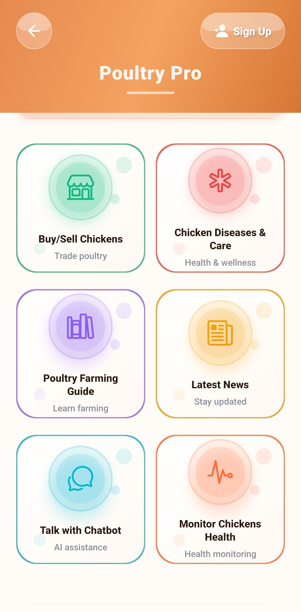
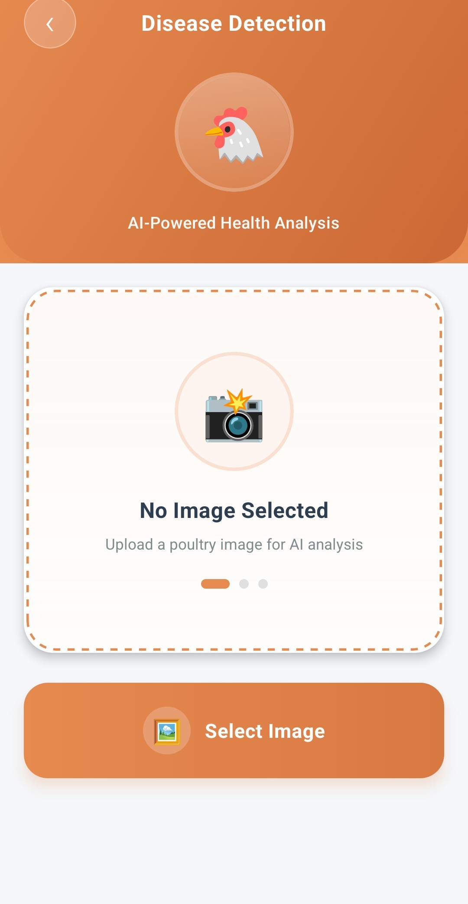
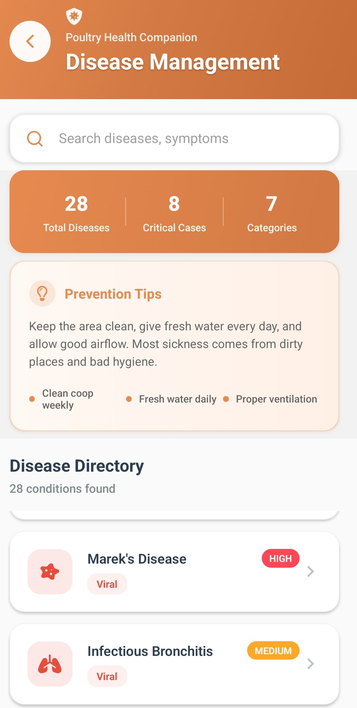
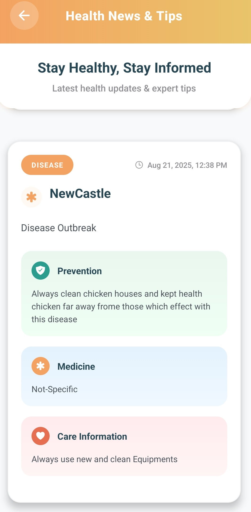
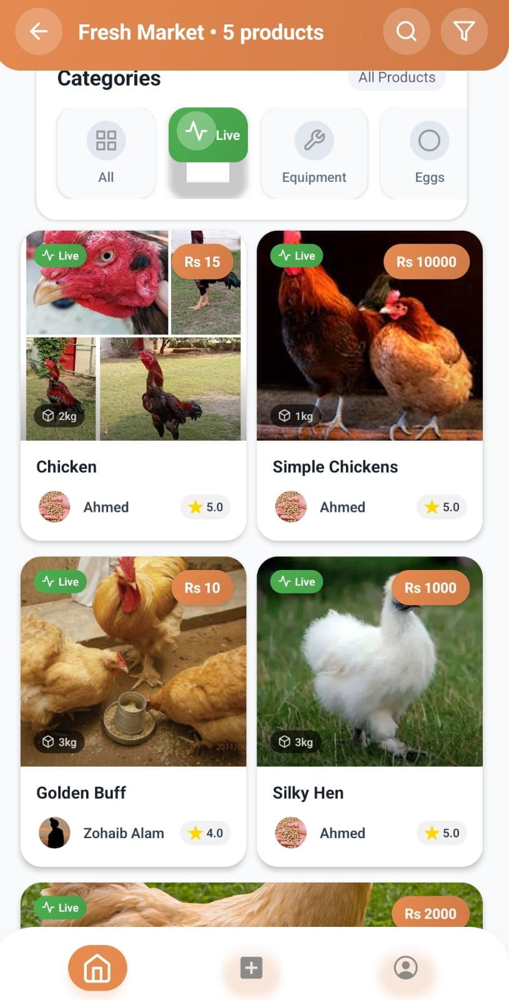
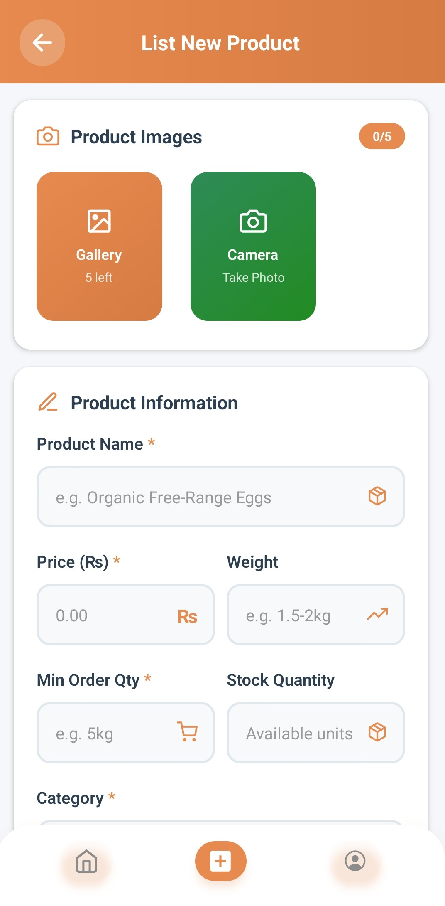
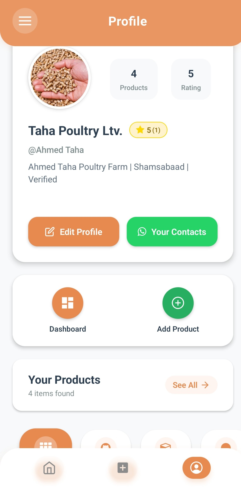
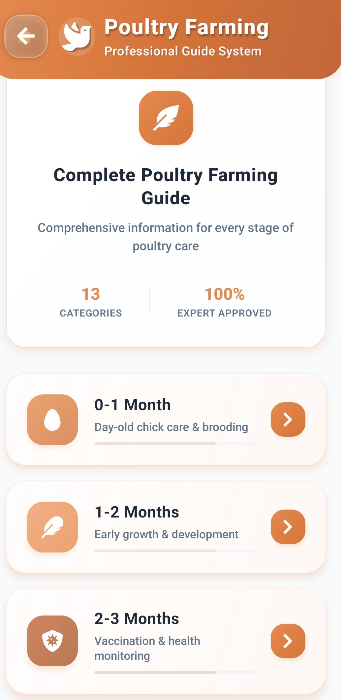

# 🐔 Poultry Pro

A smart poultry farm management app built with **React Native Expo** (frontend) and **FastAPI Python** (backend). It helps poultry farmers detect diseases from fecal images and get AI-powered farming advice in Urdu-English.

---

## 📸 Screenshots

### Home & AI Chatbot
| Home Screen | AI Assistant Chatbot |
|-------------|-------------------|
|  | [Chatbot](FrontEnd/assets/screenshots/Live_Assistant(ChatBot).jpeg) |

### Disease Detection
| Upload Image | Result - Coccidiosis | Result - Salmonella | Unknown Image |
|-------------|---------------------|-------------------|---------------|
|  | .jpeg) | .jpeg) | .jpeg) |

### Disease Management & News
| Disease Management | News & Tips |
|-------------------|-------------|-------------|
|  |  | .jpeg) |

### Market & Profile
| Live Market | List Product | Seller Profile |
|-------------|-------------|----------------|
|  |  |  |

### Farming Guide
| Poultry Farming Guide |
|----------------------|
|  |

---

## ✨ Features

- 🤖 **AI Chatbot** — Poultry assistant powered by DeepSeek via OpenRouter (Urdu-English mix)
- 🦠 **Disease Detection** — Upload poultry fecal images to detect diseases using a MobileNetV2 ML model (~96% accuracy)
- 🏥 **Disease Management** — Directory of 28 diseases across 7 categories with prevention & remedies
- 🛒 **Live Market** — Buy/sell chickens and poultry products with real listings
- 📰 **Health News & Tips** — Latest poultry health updates
- 📚 **Farming Guide** — Complete guide for every stage of poultry care (13 categories)
- 👤 **User Profiles** — Seller profiles with ratings and product listings
- 💾 **Persistent State** — Data saved across sessions using Redux Persist

---

## 🛠️ Tech Stack

### Frontend
| Tech | Purpose |
|------|---------|
| React Native + Expo | Mobile app framework |
| Redux Toolkit + Redux Persist | State management |
| Supabase | Authentication & database |
| React Navigation | Screen navigation |
| Expo Image Picker | Camera / image upload |
| React Native Chart Kit | Farm analytics charts |

### Backend
| Tech | Purpose |
|------|---------|
| FastAPI | REST API server |
| PyTorch + MobileNetV2 | Disease detection ML model |
| OpenRouter (DeepSeek) | AI chatbot |
| Python-dotenv | Environment variables |

---

## 📁 Project Structure

```
PoultryPro/
├── BackEnd/
│   ├── main.py               # FastAPI server
│   ├── model_loader.py       # ML model loader & predictor
│   ├── labels.json           # Disease class labels
│   ├── poultry_model.pt      # Trained MobileNetV2 model
│   ├── poultry_faq.txt       # Poultry knowledge base
│   └── requirements.txt      # Python dependencies
│
└── FrontEnd/
    ├── App.js                # Root app component
    ├── app.json              # Expo configuration
    ├── package.json          # JS dependencies
    ├── navigation/           # Navigation setup
    ├── redux/                # Redux store & slices
    ├── screens/              # App screens
    └── assets/
        └── screenshots/      # App screenshots
```

---

## 🚀 Getting Started

### Backend Setup

```bash
# 1. Go to backend folder
cd BackEnd

# 2. Create virtual environment
python -m venv venv
venv\Scripts\activate        # Windows
source venv/bin/activate     # Mac/Linux

# 3. Install dependencies
pip install -r requirements.txt

# 4. Create api.env file and add your key
OPENROUTER_API_KEY=your_api_key_here

# 5. Run the server
uvicorn main:app --reload
```

Backend runs at: `http://localhost:8000`

---

### Frontend Setup

```bash
# 1. Go to frontend folder
cd FrontEnd

# 2. Install dependencies
npm install

# 3. Start Expo
npx expo start
```

Scan the QR code with **Expo Go** app on your phone.

---

## 🔑 Environment Variables

Create a file called `api.env` in the BackEnd folder:

```
OPENROUTER_API_KEY=your_openrouter_api_key_here
```

> ⚠️ Never commit your API key to GitHub. It is already excluded in `.gitignore`.

---

## 🦠 Disease Detection

The app uses a **MobileNetV2** model trained to classify poultry diseases from fecal images into 4 categories. Predictions with low confidence (< 60%) or high uncertainty are rejected as **Unknown**.

**Model Accuracy: ~96%**

---

## 👨‍💻 Author

**[Zohaib Alam]**  
Final Year Project — [Comsats Uni Isl,Attock Campus]  
[2025]

