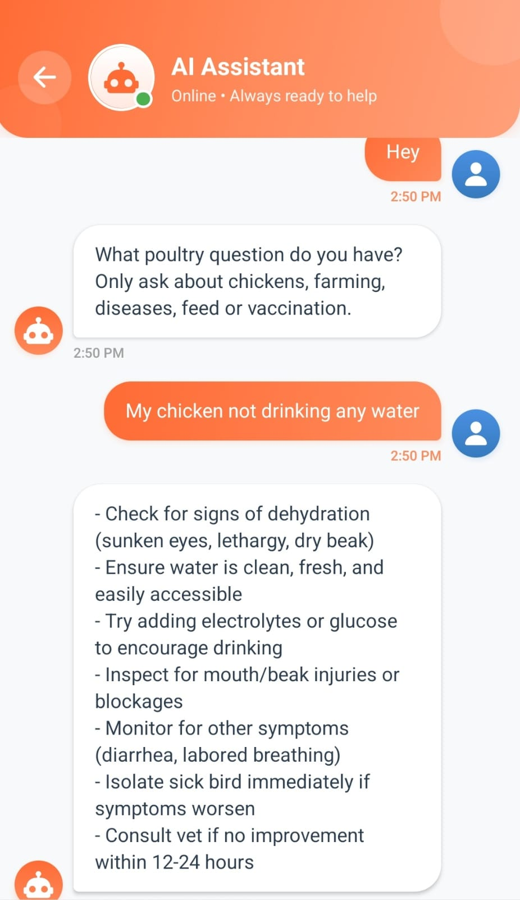
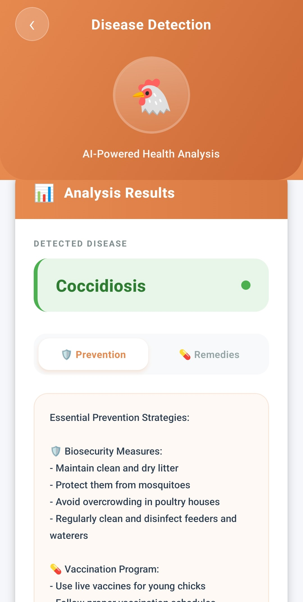
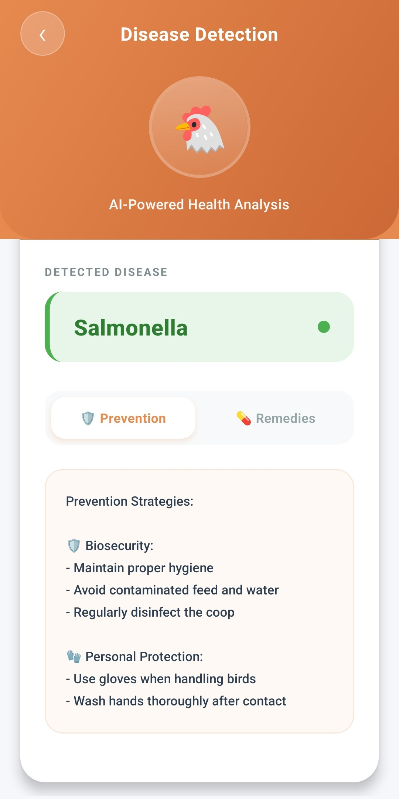
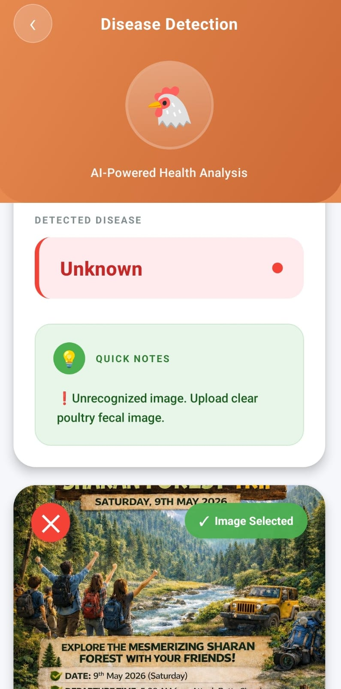
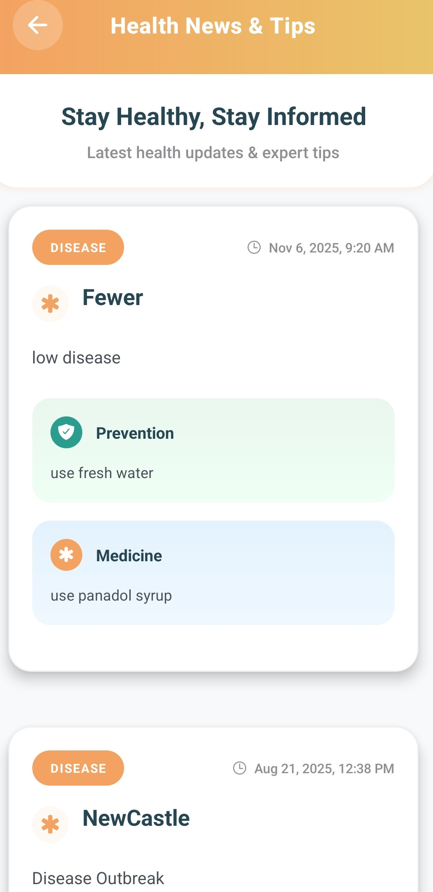

# 🐔 Poultry Pro

> **Applied AI research project** — Intelligent disease detection and farm management for rural poultry farmers in Pakistan.

## The Problem

Poultry farming contributes over **$3.5 billion** to Pakistan's agricultural economy and supports millions of rural livelihoods. Yet most small scale farmers have no access to veterinary services. A single disease outbreak can wipe out an entire flock before a farmer can get professional help. Diagnosis is slow, expensive, and often impossible in remote areas.

Poultry Pro addresses this directly: an AI-powered mobile platform that puts disease detection, veterinary guidance, and farm management tools in the hands of farmers who have a smartphone but no vet nearby.

---

## 📸 Screenshots

### Home & AI Chatbot
| Home Screen | AI Assistant Chatbot |
|-------------|-------------------|
|  |  |

### Disease Detection
| Upload Image | Result - Coccidiosis | Result - Salmonella | Unknown Image |
|-------------|---------------------|-------------------|---------------|
|  |  |  |  |

### Disease Management & News
| Disease Management | News & Tips | News Detail |
|-------------------|-------------|-------------|
|  |  |  |

### Market & Profile
| Live Market | List Product | Seller Profile |
|-------------|-------------|----------------|
|  |  |  |

### Farming Guide
| Poultry Farming Guide |
|----------------------|
|  |

---

## ✨ Features

- 🤖 **AI Chatbot** — Poultry assistant powered by DeepSeek via OpenRouter (Urdu-English mix)
- 🦠 **Disease Detection** — Upload poultry fecal images to detect diseases using a MobileNetV2 ML model (~96% accuracy)
- 🏥 **Disease Management** — Directory of 28 diseases across 7 categories with prevention and remedies
- 🛒 **Live Market** — Buy/sell chickens and poultry products with real listings
- 📰 **Health News & Tips** — Latest poultry health updates
- 📚 **Farming Guide** — Complete guide for every stage of poultry care (13 categories)
- 👤 **User Profiles** — Seller profiles with ratings and product listings
- 💾 **Persistent State** — Data saved across sessions using Redux Persist

---

## 🛠️ Tech Stack

### Frontend
| Tech | Purpose |
|------|---------|
| React Native + Expo | Mobile app framework |
| Redux Toolkit + Redux Persist | State management |
| Supabase | Authentication and database |
| React Navigation | Screen navigation |
| Expo Image Picker | Camera / image upload |
| React Native Chart Kit | Farm analytics charts |

### Backend
| Tech | Purpose |
|------|---------|
| FastAPI | REST API server |
| PyTorch + MobileNetV2 | Disease detection ML model |
| OpenRouter (DeepSeek) | AI chatbot |
| Python-dotenv | Environment variables |

---

## 📁 Project Structure

```
PoultryPro/
├── BackEnd/
│   ├── main.py               # FastAPI server
│   ├── model_loader.py       # ML model loader and predictor
│   ├── labels.json           # Disease class labels
│   ├── poultry_model.pt      # Trained MobileNetV2 model
│   ├── poultry_faq.txt       # Poultry knowledge base
│   └── requirements.txt      # Python dependencies
│
└── FrontEnd/
    ├── App.js                # Root app component
    ├── app.json              # Expo configuration
    ├── package.json          # JS dependencies
    ├── navigation/           # Navigation setup
    ├── redux/                # Redux store and slices
    ├── screens/              # App screens
    └── assets/
        └── screenshots/      # App screenshots
```

---

## 🚀 Getting Started

### Backend Setup

```bash
# 1. Go to backend folder
cd BackEnd

# 2. Create virtual environment
python -m venv venv
venv\Scripts\activate        # Windows
source venv/bin/activate     # Mac/Linux

# 3. Install dependencies
pip install -r requirements.txt

# 4. Create api.env file and add your key
OPENROUTER_API_KEY=your_api_key_here

# 5. Run the server
uvicorn main:app --reload
```

Backend runs at: `http://localhost:8000`

---

### Frontend Setup

```bash
# 1. Go to frontend folder
cd FrontEnd

# 2. Install dependencies
npm install

# 3. Start Expo
npx expo start
```

Scan the QR code with **Expo Go** app on your phone.

---

## 🔑 Environment Variables

Create a file called `api.env` in the BackEnd folder:

```
OPENROUTER_API_KEY=your_openrouter_api_key_here
```

> ⚠️ Never commit your API key to GitHub. It is already excluded in `.gitignore`.

---

## 🦠 Disease Detection Model

The app uses a **MobileNetV2** model trained on poultry fecal images to classify diseases into 4 categories. Predictions with low confidence (below 60%) are rejected as **Unknown** to prevent false diagnoses in the field.

**Model Accuracy: ~96%**

---

## 👨‍💻 Author

**Zohaib Alam**
Final Year Project, COMSATS University Islamabad, Attock Campus (2025)
BCS — Bachelor of Computer Science

- LinkedIn: [linkedin.com/in/zohaib-alam-a1656b351](https://linkedin.com/in/zohaib-alam-a1656b351)
- GitHub: [github.com/Zohaibi099](https://github.com/Zohaibi099)
- Email: zohaibalam970@gmail.com

*Research interests: Applied AI, LLMs for domain-specific applications, intelligent systems for agriculture and healthcare in developing regions.*
